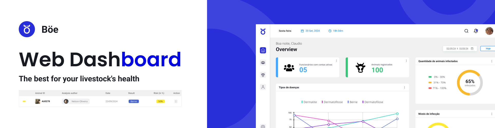
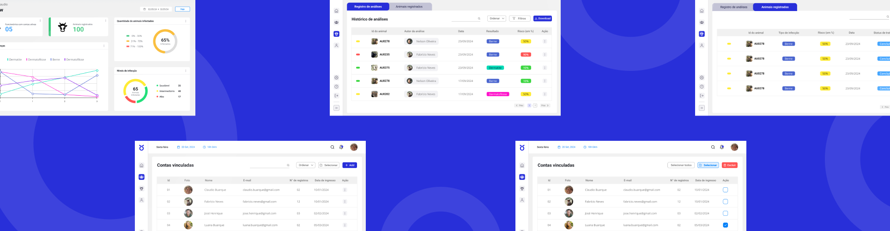
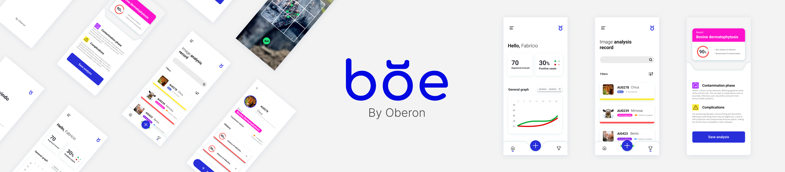

<h1 align="center">🐄 Boe Web Dashboard</h1>

## 🚀 O que é?
O Boe Web Dashboard é um sistema desenvolvido no contexto do projeto integrador do curso de Desenvolvimento de Software Multiplataforma da Fatec Registro. Ele foi criado para apoiar o aplicativo Boe, que realiza um pré-diagnóstico de doenças dermatológicas em bovinos. 🐂

Com o Boe, o usuário consegue registrar seu animal, tirar uma foto da pele dele e, usando inteligência artificial, receber um diagnóstico de possíveis doenças, além de informações sobre o nível de infecção e complicações. E o Boe Web Dashboard entra como uma ferramenta para os administradores de propriedades rurais acompanharem o histórico de saúde dos animais e tomarem decisões baseadas em dados.

A arquitetura do BOE é composta por 4 desenvolvimentos: [BoeMobileApp](https://github.com/isefshondo/BoeMobileAppV2),[BoeWebDashboard](https://github.com/RebecaBaruch/boe-web-dashboard), [BoeBff](https://github.com/isefshondo/BoeApiV2) e [BoeAI](https://github.com/mayarakaren/IA-ClassificationBoe).

### Algumas funcionalidades chave:

- **Cadastro do Administrador e Propriedade**: O administrador cria sua conta com dados pessoais e informações da fazenda.
- **Gráficos de Desempenho**: Visualize dados do aplicativo em gráficos, filtrados por período, com informações sobre os animais.
- **Histórico Completo**: Acompanhe o histórico de análises realizadas no aplicativo, com informações sobre o tipo de infecção e risco de cada animal.
- **Envio de Convites**: Envie convites para que novos usuários associem suas contas à fazenda e contribuam com dados.
- **Relatórios em PDF**: Baixe registros individuais ou coletivos em formato PDF, para uma análise mais aprofundada.

E, claro, o sistema está focado em ajudar a monitorar doenças como **Berne**, **Dermatofitose**, **Dermatite** e **Dermatofilose**. 🐄💉



## 🏗️ Arquitetura

A arquitetura do projeto é modular, organizada em camadas que separam responsabilidades, facilitando a manutenção e escalabilidade:

- **Raiz**: Contém as configurações e arquivos essenciais.
  - **public**, **github**, **node_modules**, **next**, **src**.
  - Dentro de **src**, temos:
    - **@types**: Tipagens TypeScript.
    - **components**: Componentes reutilizáveis.
    - **config**: Configurações globais.
    - **hooks**: Custom hooks.
    - **pages**: Páginas da aplicação, estruturadas com controllers e views.
    - **services**: Serviços para integrar com a API.
    - **utils**: Funções utilitárias.
  - **tests**: Estrutura de testes unitários na mesma organização da pasta **src**.

Essa estrutura modular facilita a organização e reutilização de código, promovendo uma boa separação de responsabilidades.

## 🔧 Tecnologias
&nbsp;
&nbsp;
&nbsp;
&nbsp;
&nbsp;
&nbsp;
&nbsp;
&nbsp;
&nbsp;

Outras tecnologias e bibliotecas:
- **Stryker Mutator** para testes de mutação.
- **Mistica Telefônica** como biblioteca de componentes (com a maioria dos componentes sendo autorais).
- **@react-pdf/renderer**, **jsPDF** e **jsPDF-autotable** para gerar PDFs.
- **Power BI** para a criação de dashboards interativos e visualização de dados (em construção 🛠)

## 🚀 CI/CD Pipeline e Workflow

A pipeline de **integração contínua (CI)** é acionada em **pull requests** para a branch **master**. O workflow inclui as seguintes etapas:

1. **Lint**: Verificação do código com **ESLint**.
2. **Testes**: Execução dos testes unitários com **Jest** e relatório de cobertura.
3. (Opcional) **Prettier**: Verificação do formato do código.

# 📊 Organização de Épicos e Histórias

As histórias e épicos para o desenvolvimento organizado do **Boe Web Dashboard** podem ser acessados [aqui](https://www.notion.so/picos-e-Hist-rias-11d8d56e814b80d487d6ebc6bba56971?pvs=4). Para visualizar, é necessário solicitar acesso.

## 📑 Regras de Pull Request

### 🧑‍💻 Nomenclatura das Branches

- As branches devem seguir a história a que estão associadas. Exemplo:
  - **História:** PI6BOE-1001
  - **Nome da branch:** PI6BOE-1001

### 🔄 Nomenclatura do Pull Request

- O título deve começar com "TASK:", seguido da história. Exemplo:
  - **Título:** [TASK:PI6BOE-1001]

### ✅ Boas Práticas

- 📝 Comite frequentemente, com mensagens claras e concisas, na língua inglesa (en-us).
- 🚀 Use o padrão do repositório [Padrões de Commits](https://github.com/iuricode/padroes-de-commits).

### ⚙️ Layout de Pull Request

- **Tipo de mudança**:

  - [ ] 🐛 Bugfix
  - [ ] ✨ Nova feature
  - [ ] 🔨 Refatoração
  - [ ] 📚 Documentação

- **Checklist**:
  - [ ] O código segue o guia de estilo e boas práticas da equipe.
  - [ ] Realizei testes locais e todos passaram.
  - [ ] Adicionei testes unitários para garantir que a feature funcione conforme esperado.
  - [ ] A documentação foi atualizada (se necessário).

## 🔗 Integração com API e Aplicativo Mobile

### 🌐 API

A **Boe Web Dashboard** se integra com a **API Boe**, que fornece os dados necessários para o funcionamento da aplicação. As instruções para instalar e configurar a API estão disponíveis no [repositório da API Boe](https://github.com/isefshondo/BoeApiV2), criada por **@isefshondo**.

### 📱 Aplicativo Mobile

O sistema também se conecta com o **Boe Mobile App**, usado pelos donos de gado para realizar o pré-diagnóstico de doenças dermatológicas. O código do aplicativo pode ser acessado no [repositório do Boe Mobile App](https://github.com/isefshondo/BoeMobileAppV2), também desenvolvido por **@isefshondo**.

## 🛠️ Como Instalar

Para rodar o **Boe Web Dashboard** localmente, siga os passos abaixo:

### Pré-requisitos

- **Node.js** (versão 16 ou superior)
- **npm** (gerenciador de pacotes)

### Passos para Instalação

1. **Clone o repositório**:

   ```bash
   git clone https://github.com/RebecaBaruch/boe-web-dashboard.git
   ```

2. **Entre no diretório do projeto:**

   ```
   cd boe-web-dashboard
   ```

3. **Instale as dependências:**

   ```
   npm install
   ```

4. **Execute a aplicação:**

   ```
   npm run dev
   ```

5. **Abra seu navegador e acesse http://localhost:3000 para visualizar a aplicação.**

### 📄 Configuração da API

Se você também precisa configurar a API Boe, consulte as instruções no repositório da [BoeApiV2](https://github.com/isefshondo/BoeApiV2).


## Quer contribuir com a melhora desta aplicação? 😊💙

É simples! Se você deseja contribuir para o desenvolvimento do Boe Web Dashboard ou tem dúvidas, você também pode entrar em contato com a gente. Em uma branch separada, implemente suas sugestões e abra uma Pull Request! Você pode colocar como revisores os seguintes perfis:

- [Isabelle (@isefshondo)](https://github.com/isefshondo)
- [Mayara (@mayarakaren)](https://github.com/mayarakaren)
- [Nayara (@NahAzevedo)](https://github.com/NahAzevedo)
- [Rebeca (@RebecaBaruch)](https://github.com/RebecaBaruch)

#### 🎨 Figma do Projeto
O layout e design do **Boe Web Dashboard** podem ser visualizados no Figma através [deste link](https://www.figma.com/design/cvLw92mqgMty9e3KDp1R6Q/BOE?node-id=603-2&t=RQD6WhoRtFEg49vV-1).
